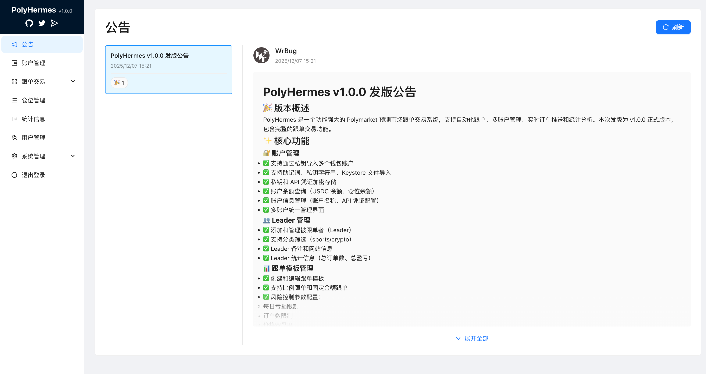
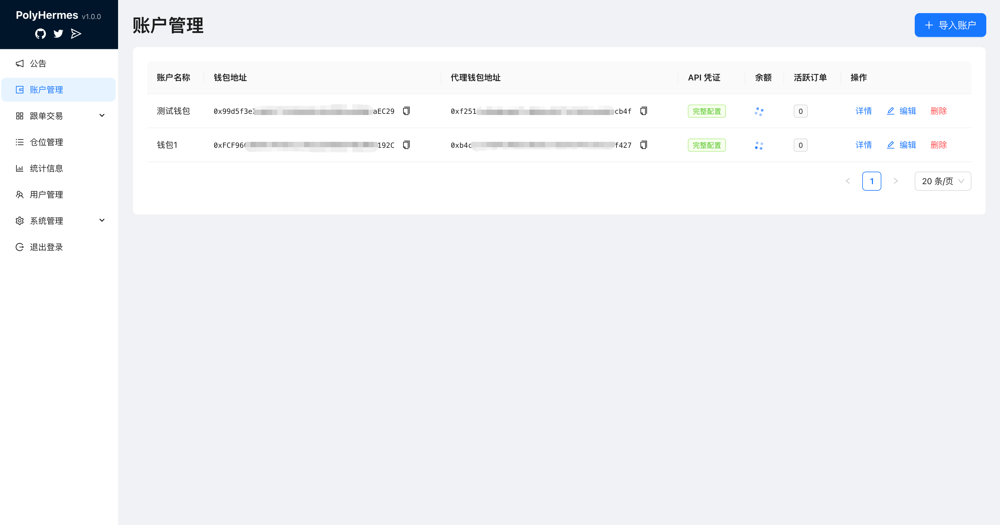
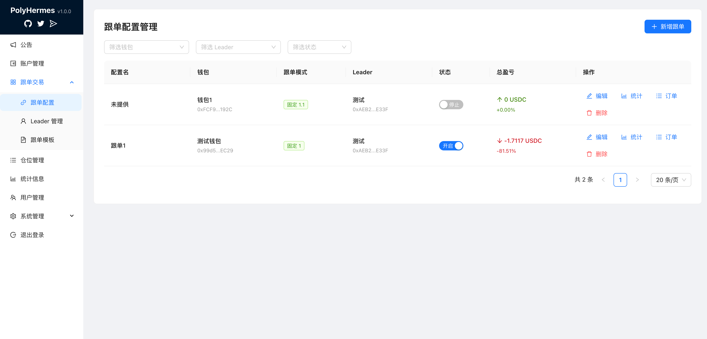
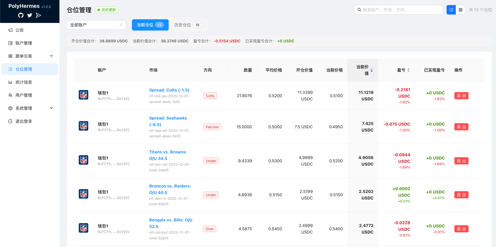
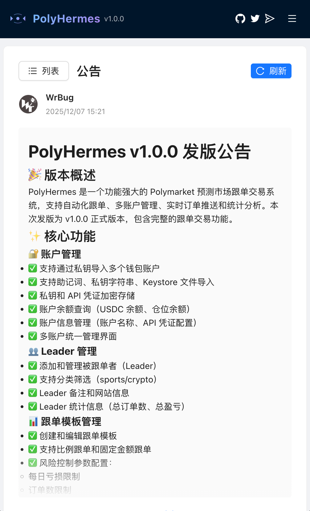
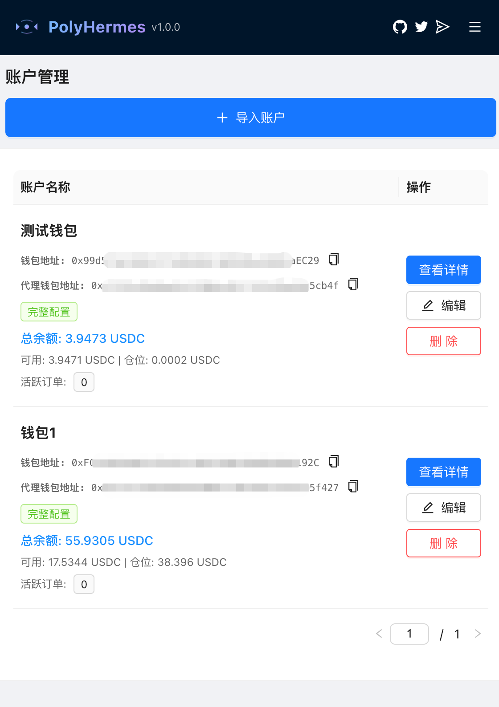
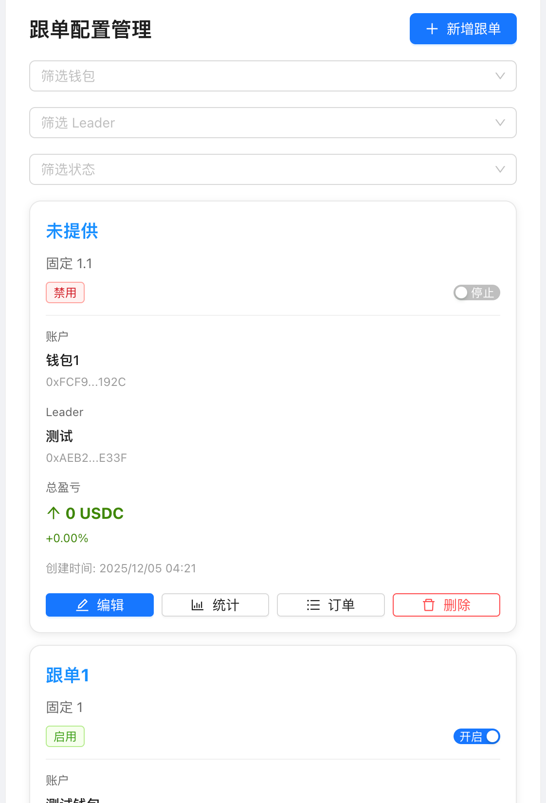

# PolyHermes

[](https://github.com/WrBug/PolyHermes)
[](https://x.com/quant_tr)

一个功能强大的 Polymarket 预测市场跟单交易系统，支持自动化跟单、多账户管理、实时订单推送和统计分析。

---

## 📋 目录

- [第一部分：产品功能说明](#第一部分产品功能说明)
- [第二部分：如何部署](#第二部分如何部署)
- [第三部分：开发文档](#第三部分开发文档)

---

## 第一部分：产品功能说明

### 📸 界面预览

#### 🖥️ 桌面端
<div align="center">
  <table>
    <tr>
      <td align="center">
        
      </td>
      <td align="center">
        
      </td>
    </tr>
    <tr>
      <td align="center">
        
      </td>
      <td align="center">
        
      </td>
    </tr>
  </table>
</div>

#### 📱 移动端
<div align="center">
  <table>
    <tr>
      <td align="center">
        
      </td>
      <td align="center">
        
      </td>
      <td align="center">
        
      </td>
    </tr>
    <tr>
      <td colspan="3" align="center">
        
      </td>
    </tr>
  </table>
</div>

### ✨ 核心功能

#### 🔐 账户管理
- **多账户支持**：通过私钥导入多个钱包账户，统一管理
- **安全存储**：私钥和 API 凭证加密存储，确保数据安全
- **账户信息**：查看账户余额、持仓、交易记录等详细信息
- **账户编辑**：支持修改账户名称、设置默认账户等

#### 👥 Leader 管理
- **添加 Leader**：添加被跟单者（Leader）的钱包地址
- **分类筛选**：支持按分类筛选（sports/crypto）
- **Leader 信息**：查看 Leader 的交易历史、统计信息
- **备注管理**：为 Leader 添加备注，方便识别和管理

#### 📊 跟单模板
- **灵活配置**：创建跟单模板，配置跟单参数
- **跟单方式**：支持比例跟单和固定金额跟单
- **风险控制**：配置每日亏损限制、订单数限制、价格容忍度等
- **模板复用**：一个模板可以用于多个跟单关系

#### 🔄 跟单配置
- **关系管理**：将账户、模板和 Leader 关联，创建跟单关系
- **启用/禁用**：灵活控制跟单关系的启用状态
- **自动跟单**：实时监控 Leader 交易，自动复制订单（支持买入和卖出）
- **订单跟踪**：完整的订单生命周期跟踪，包括买入、卖出和匹配记录

#### 📈 订单管理
- **买入订单**：查看所有买入订单的详细信息
- **卖出订单**：查看所有卖出订单的详细信息
- **匹配订单**：查看已匹配的订单记录
- **订单筛选**：支持按账户、Leader、时间范围等条件筛选

#### 💼 仓位管理
- **实时持仓**：实时查看和管理所有账户的持仓
- **仓位推送**：通过 WebSocket 实时推送仓位变化
- **卖出仓位**：支持市价和限价卖出仓位
- **赎回仓位**：支持批量赎回已结算的仓位

#### 📊 统计分析
- **全局统计**：查看所有跟单关系的汇总统计
- **Leader 统计**：查看特定 Leader 的统计信息
- **分类统计**：按分类（sports/crypto）查看统计
- **跟单关系统计**：查看单个跟单关系的详细统计
- **时间筛选**：支持按时间范围筛选统计数据

#### ⚙️ 系统管理
- **代理配置**：通过 Web UI 配置 HTTP 代理，无需修改环境变量
- **API 健康检查**：实时监控 Polymarket API 的健康状态
- **用户管理**：管理系统用户，支持添加、编辑、删除用户
- **公告管理**：查看系统公告和更新信息

### 🚀 技术特性

- **WebSocket 实时推送**：订单和仓位数据实时推送，无需手动刷新
- **安全存储**：私钥和 API 凭证使用 AES 加密存储
- **响应式设计**：完美支持移动端和桌面端，提供一致的用户体验
- **高性能**：异步处理、并发优化，支持大量订单处理
- **风险控制**：每日亏损限制、订单数限制、价格容忍度等多重风险控制机制
- **多语言支持**：支持中文（简体/繁体）和英文
- **版本管理**：自动版本号显示和管理，支持 GitHub Releases 自动构建

### 🏗️ 技术栈

#### 后端
- **框架**: Spring Boot 3.2.0
- **语言**: Kotlin 1.9.20
- **数据库**: MySQL 8.2.0
- **ORM**: Spring Data JPA
- **数据库迁移**: Flyway
- **HTTP 客户端**: Retrofit 2.9.0 + OkHttp 4.12.0
- **WebSocket**: Spring WebSocket

#### 前端
- **框架**: React 18 + TypeScript
- **构建工具**: Vite
- **UI 库**: Ant Design 5.12.0
- **HTTP 客户端**: axios
- **状态管理**: Zustand
- **路由**: React Router 6
- **以太坊库**: ethers.js 6.9.0
- **多语言**: react-i18next

---

## 第二部分：如何部署

### 🚀 快速部署

#### 一体化部署（推荐）

将前后端一起部署到一个 Docker 容器中，使用 Nginx 提供前端静态文件并代理后端 API。

**前置要求**：
- Docker 20.10+
- Docker Compose 2.0+

**部署步骤**：

1. **使用 Docker Hub 镜像（推荐，生产环境首选）**

**方式 1：独立部署（无需 clone 代码，推荐）**

适用于生产环境，无需下载项目代码，只需两个文件即可部署：

```bash
# 1. 创建部署目录
mkdir polyhermes && cd polyhermes

# 2. 下载生产环境配置文件
# 从 GitHub 下载 docker-compose.prod.yml 和 docker-compose.prod.env.example
curl -O https://raw.githubusercontent.com/WrBug/PolyHermes/main/docker-compose.prod.yml
curl -O https://raw.githubusercontent.com/WrBug/PolyHermes/main/docker-compose.prod.env.example

# 3. 创建配置文件
cp docker-compose.prod.env.example .env

# 4. 编辑 .env 文件，修改以下必需配置：
#    - DB_PASSWORD: 数据库密码
#    - JWT_SECRET: 使用 openssl rand -hex 64 生成
#    - ADMIN_RESET_PASSWORD_KEY: 使用 openssl rand -hex 32 生成

# 5. 启动服务
docker-compose -f docker-compose.prod.yml up -d

# 6. 查看日志
docker-compose -f docker-compose.prod.yml logs -f

# 7. 停止服务
docker-compose -f docker-compose.prod.yml down
```

**方式 2：使用部署脚本（需要 clone 代码）**

```bash
# 如果已经 clone 了代码
./deploy.sh --use-docker-hub
```

**方式 3：修改现有 docker-compose.yml**

```bash
# 1. 修改 docker-compose.yml，取消注释：
#    image: wrbug/polyhermes:latest
#    并注释掉 build 部分
# 2. 创建 .env 文件（见下方）
# 3. 启动服务
docker-compose up -d
```

**优势**：
- ✅ 无需本地构建，快速部署
- ✅ 无需 clone 代码，只需配置文件即可部署
- ✅ 使用官方构建的镜像，包含正确的版本号
- ✅ 支持多架构（amd64、arm64），自动选择匹配的架构
- ✅ 生产环境推荐方式

**拉取特定版本**：

```bash
# 修改 docker-compose.prod.yml 中的镜像标签
# image: wrbug/polyhermes:v1.0.0
```

2. **本地构建部署（开发环境）**

```bash
# 使用部署脚本
./deploy.sh
```

脚本会自动：
- 检查 Docker 环境
- 创建 `.env` 配置文件（如果不存在）
- 构建 Docker 镜像（包含前后端）
- 启动服务（应用 + MySQL）

3. **手动部署**

```bash
# 创建 .env 文件
cat > .env <<EOF
DB_URL=jdbc:mysql://mysql:3306/polyhermes?useSSL=false&serverTimezone=UTC&characterEncoding=utf8&allowPublicKeyRetrieval=true
DB_USERNAME=root
DB_PASSWORD=your_password_here
SPRING_PROFILES_ACTIVE=prod
SERVER_PORT=80
POLYGON_RPC_URL=https://polygon-rpc.com
JWT_SECRET=your-jwt-secret-key-change-in-production
ADMIN_RESET_PASSWORD_KEY=your-admin-reset-key-change-in-production
EOF

# 构建并启动
docker-compose build
docker-compose up -d

# 查看日志
docker-compose logs -f

# 停止服务
docker-compose down
```

**访问应用**：
- 前端和后端统一访问：`http://localhost:80`
- Nginx 自动处理：
  - `/api/*` → 后端 API（`localhost:8000`）
  - `/ws` → 后端 WebSocket（`localhost:8000`）
  - 其他路径 → 前端静态文件

**使用外部 Nginx 反向代理（生产环境推荐）**：

在生产环境中，建议在 Docker 容器外部部署 Nginx 作为反向代理，用于 SSL/TLS 终止、域名绑定等。

详细配置请参考：[部署文档 - Nginx 反向代理](docs/DEPLOYMENT.md#使用外部-nginx-反向代理生产环境推荐)

### 📦 分别部署

#### 后端部署

**Java 直接部署**：

```bash
cd backend
./deploy.sh java
```

**Docker 部署**：

```bash
cd backend
./deploy.sh docker
```

#### 前端部署

```bash
cd frontend
# 使用默认后端地址（相对路径）
./build.sh

# 或指定自定义后端地址（跨域场景）
./build.sh --api-url http://your-backend-server.com:8000
```

### ⚙️ 环境配置

#### 必需的环境变量

| 变量名 | 说明 | 默认值 |
|--------|------|--------|
| `DB_USERNAME` | 数据库用户名 | `root` |
| `DB_PASSWORD` | 数据库密码 | - |
| `SERVER_PORT` | 后端服务端口 | `8000` |
| `POLYGON_RPC_URL` | Polygon RPC 地址 | `https://polygon-rpc.com` |
| `JWT_SECRET` | JWT 密钥 | - |
| `ADMIN_RESET_PASSWORD_KEY` | 管理员密码重置密钥 | - |
| `CRYPTO_SECRET_KEY` | 加密密钥（用于加密存储私钥和 API Key） | - |

#### 代理配置

系统支持通过 Web UI 配置 HTTP 代理，无需修改环境变量：

1. 进入"系统管理"页面
2. 配置代理主机、端口、用户名和密码
3. 启用代理并测试连接
4. 配置实时生效，无需重启服务

### 📚 详细部署文档

更多部署选项和详细说明，请参考：[部署文档](docs/DEPLOYMENT.md)

包括：
- 一体化部署详细步骤
- 后端部署（Java/Docker）
- 前端部署
- 环境配置说明
- 常见问题解答

### 🔄 版本管理

项目支持自动版本号管理和 Docker 镜像构建：

- **自动构建**：通过 GitHub Releases 页面创建 release 时自动构建 Docker 镜像
- **自动删除**：删除 release 时自动删除对应的 Docker 镜像标签
- **版本号显示**：前端自动显示当前版本号

详细说明请参考：[版本号管理文档](docs/VERSION_MANAGEMENT.md)

---

## 第三部分：开发文档

详细的开发指南、API 接口文档、代码规范等，请参考：

### 📖 [开发文档](docs/DEVELOPMENT.md)

开发文档包含以下内容：

- **项目结构**：详细的目录结构说明
- **开发环境配置**：如何搭建开发环境
- **代码规范**：后端和前端开发规范
- **API 接口文档**：所有 API 接口的详细说明
- **数据库设计**：数据库表结构说明
- **前端开发指南**：前端开发最佳实践
- **后端开发指南**：后端开发最佳实践
- **常见问题**：开发过程中常见问题的解答

### 📚 其他文档

- [部署文档](docs/DEPLOYMENT.md) - 详细的部署指南（Java/Docker）
- [版本号管理文档](docs/VERSION_MANAGEMENT.md) - 版本号管理和自动构建
- [跟单系统需求文档](docs/copy-trading-requirements.md) - 后端 API 接口文档
- [前端需求文档](docs/copy-trading-frontend-requirements.md) - 前端功能文档

### 🤝 贡献指南

欢迎贡献代码！请遵循以下步骤：

1. Fork 本仓库
2. 创建特性分支 (`git checkout -b feature/AmazingFeature`)
3. 遵循代码规范（参考开发文档）
4. 提交更改 (`git commit -m 'feat: Add some AmazingFeature'`)
5. 推送到分支 (`git push origin feature/AmazingFeature`)
6. 开启 Pull Request

### 📝 开发规范

- **后端**: 遵循 Kotlin 编码规范，使用 Spring Boot 最佳实践
- **前端**: 遵循 TypeScript 和 React 最佳实践
- **提交信息**: 使用清晰的提交信息，遵循 [Conventional Commits](https://www.conventionalcommits.org/)

详细开发规范请参考：
- [后端开发规范](.cursor/rules/backend.mdc)
- [前端开发规范](.cursor/rules/frontend.mdc)

---

## ⚠️ 免责声明

本软件仅供学习和研究使用。使用本软件进行交易的风险由用户自行承担。作者不对任何交易损失负责。

## 📄 许可证

本项目采用 MIT 许可证。详情请参阅 [LICENSE](LICENSE) 文件。

## 🔗 相关链接

- [GitHub 仓库](https://github.com/WrBug/PolyHermes)
- [Twitter](https://x.com/quant_tr)
- [Polymarket 官网](https://polymarket.com)
- [Polymarket API 文档](https://docs.polymarket.com)

## 🙏 致谢

感谢所有为本项目做出贡献的开发者和用户！

---

**⭐ 如果这个项目对你有帮助，请给个 Star！**
